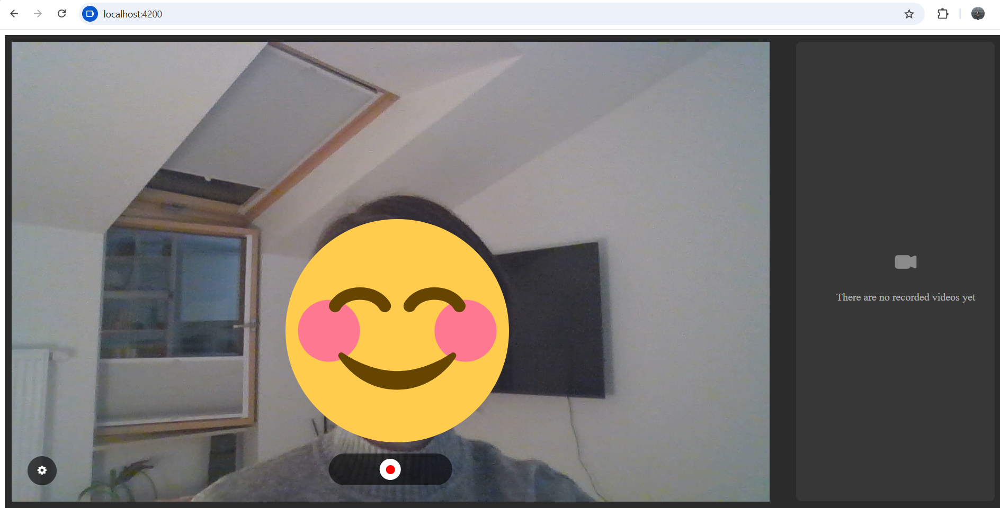
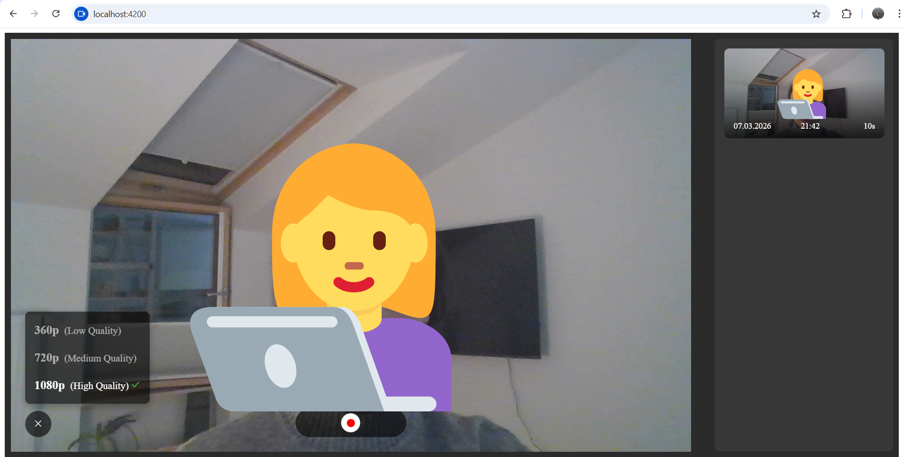
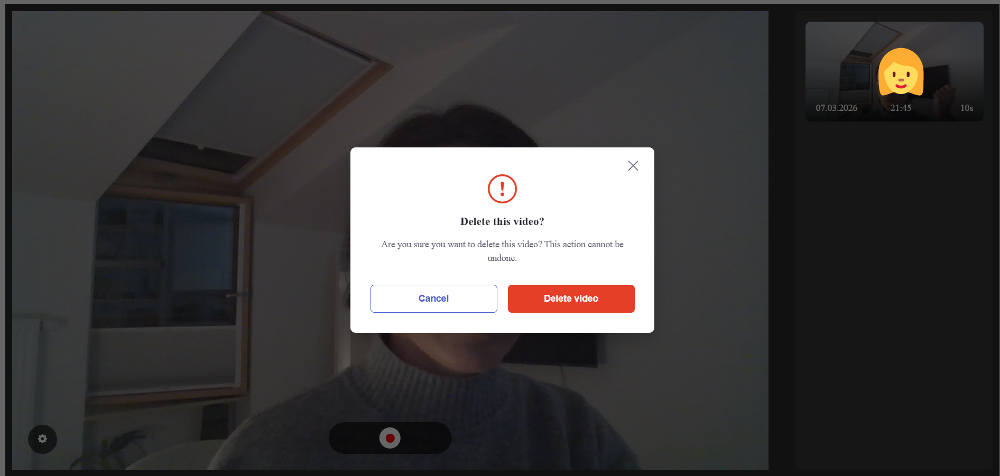
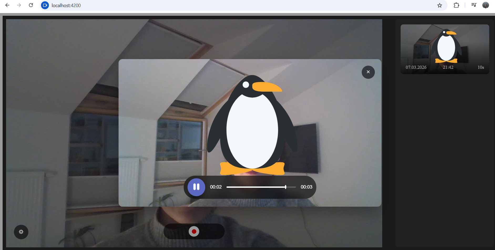
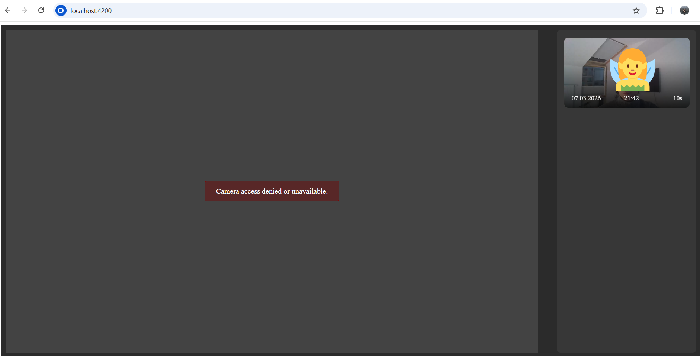
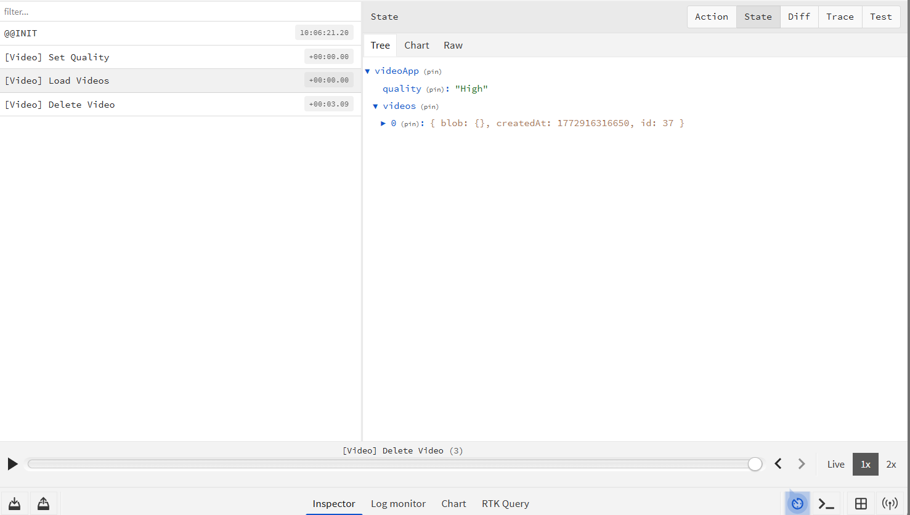

# Video Recorder App

A browser-based video recording application built with **Angular 17**, **NGXS** for state management, and **Dexie.js** (IndexedDB) for persistent local storage.

---

## Table of Contents

- [Setup Instructions](#setup-instructions)
- [Persistence & Video Storage Approach](#persistence--video-storage-approach)
- [State Management Approach](#state-management-approach)
- [Assumptions & Challenges](#assumptions--challenges)
- [Screenshots](#screenshots)

---

## Setup Instructions

### Prerequisites

- [Node.js](https://nodejs.org/) (v18+ recommended)
- [npm](https://www.npmjs.com/) (comes with Node.js)
- A modern browser with webcam/microphone access (Chrome recommended)

### Installation

1. **Clone the repository:**
   ```bash
   git clone [https://github.com/anirogava/video-recorder](https://github.com/anirogava/video-recorder)
   
2. **Install dependencies:**
   ```bash
   npm install

3. **Start the development server:**
   ```bash
   npm start
The app will be available at http://localhost:4200.

**Other Commands**

   **npm start** Start dev server
   **npm run build** Build for production
   **npm run prettier** Format all source files

## Persistence & Video Storage Approach

**Storage: IndexedDB via Dexie.js**
Video blobs are stored directly in the browser's IndexedDB using Dexie.js (v4.3.0), a lightweight wrapper around the IndexedDB API.

**Why IndexedDB / Dexie?**

* IndexedDB can store large binary data (Blob) natively, unlike localStorage which is limited to ~5MB and only handles strings.
* Dexie provides a clean, promise-based API that integrates seamlessly with Angular's async patterns.
* Data persists across page reloads without requiring a backend server.

**Database Schema:**
* **Database name:** VideoRecorderDB

* **Table:** videos

* **id:** (auto-increment, primary key)

* **title:** (optional string)

* **createdAt:** (timestamp in milliseconds)

* **blob:** (Blob — the raw video data in WebM format)

**Video Recording: MediaRecorder API**
Video is captured using the browser-native MediaRecorder API with getUserMedia. Recordings are saved as video/webm blobs, chunked during recording, and assembled on stop.

## State Management Approach
Application state is managed with **NGXS (v18)**, a Redux-inspired state management library for Angular.

```typescript
{ 
  quality: VideoQuality; // 'Low' | 'Medium' | 'High' 
  // videos: VideoRecord[]; - list of stored video records 
}
```
**Actions**
**LoadVideos:** Loads all persisted videos from IndexedDB into state on app init
**AddVideo:** Saves a new video to IndexedDB and appends it to the state
**DeleteVideo:** Removes a video from IndexedDB and from the state
**SetQuality:** Updates the active recording quality
Every state mutation is also persisted to IndexedDB, keeping the UI state and the database always in sync.

## Assumptions & Challenges

**Assumptions**

* The app is intended to run in a modern desktop browser (Chrome/Edge preferred) that supports MediaRecorder, getUserMedia, and IndexedDB.
* No backend or user authentication is required — all data is stored locally in the browser.
* Videos are not given a custom title at record time; they are identified by their creation timestamp.

**Challenges & Solutions**

* **Bandwidth Detection (BandwidthService):** Determining true network speed directly in the browser is notoriously difficult without a dedicated backend server to bounce packets off of.
  * **Approach:** To solve this purely on the frontend, the BandwidthService downloads a specific, known-size asset (assets/test-image.jpg at ~500KB) and measures the exact time it takes to fetch the blob. It uses a cache-busting query parameter (?nnn=timestamp) to ensure the browser doesn't load a cached version, guaranteeing an accurate active download measurement. The resulting speed is calculated in Mbps to determine the initial camera quality (Low < 2 Mbps, Medium 2-5 Mbps, High > 5 Mbps). If the test fails (e.g., file missing or network drop), it safely defaults to Medium quality.
* **Blob storage in IndexedDB:** Storing raw Blob objects in IndexedDB works in modern browsers but requires Dexie to handle serialization correctly. Care was taken to ensure the blob field is not indexed (only id, title, and createdAt are indexed).
* **Camera re-initialization on quality change:** Changing the video quality requires stopping the existing MediaStream and acquiring a new one with different constraints, which needed to be handled carefully to avoid stream leaks and "camera in use" errors.
* **Recording progress timer:** The auto-stop feature is implemented via an RxJS interval observable with a takeWhile guard. This ensures the subscription is always cleaned up automatically when recording stops, avoiding memory leaks.
* **Safe URL handling:** Video Blob objects must be converted to object URLs for playback. A custom SafeUrlPipe was implemented to safely bypass Angular's DOM sanitizer

## Screenshots






